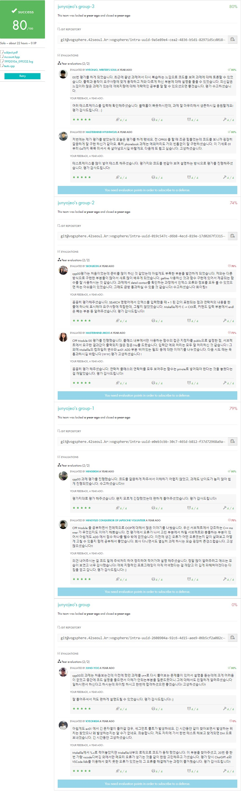

# CPP Module 00

<div align="center">
  
  
  [](https://github.com/junyjeon/CPP-Module-00)
  [](https://github.com/junyjeon/CPP-Module-00)
</div>

## 목차
- [개요](#개요)
- [요구사항](#요구사항)
- [구현](#구현)
  - [ex00: Megaphone](#ex00-megaphone)
  - [ex01: My Awesome PhoneBook](#ex01-my-awesome-phonebook)
  - [ex02: The Job Of Your Dreams](#ex02-the-job-of-your-dreams)
- [사용법](#사용법)
- [테스트 & 디버그](#테스트--디버그)
- [추가 정보](#추가-정보)
  - [C++98 특징](#c98-특징)
  - [클래스 vs 구조체](#클래스-vs-구조체)
- [참고 자료](#참고-자료)

### 🗣️ 개요
C++의 기본 문법과 클래스를 학습하는 첫 번째 C++ 모듈입니다.

• 학습 목표
  - C++의 기본 문법과 특징 이해
  - 객체지향 프로그래밍의 기초 습득
  - 클래스와 객체의 개념 파악
  - 메모리 관리와 범위의 이해

• 주요 개념
  - 네임스페이스와 스코프
  - 클래스와 멤버 함수
  - 접근 제어와 캡슐화
  - 정적 멤버와 인스턴스 멤버
  - 입출력 스트림

### 요구사항
• 컴파일러
  - c++ (clang++)
  - -Wall -Wextra -Werror
  - -std=c++98

• 금지 사항
  - STL 사용 금지
  - <string.h> 대신 <string> 사용
  - printf 대신 cout 사용
  - 전역 변수 사용 금지

### 구현
#### ex00: Megaphone
• 요구사항
  - 입력된 문자열을 대문자로 변환
  - 인자가 없을 경우 기본 메시지 출력
  - 여러 인자 처리 가능

• 목표
  - C++ 스타일 입출력 학습
  - 문자열 처리 기초 학습
  - 프로그램 인자 처리 학습

• 구현 요소
```cpp
#include <iostream>
#include <string>

int main(int ac, char **av)
{
    if (ac == 1)
        std::cout << "* LOUD AND UNBEARABLE FEEDBACK NOISE *";
    else
    {
        for (int i = 1; i < ac; i++)
        {
            std::string str(av[i]);
            for (size_t j = 0; j < str.length(); j++)
                std::cout << (char)std::toupper(str[j]);
        }
    }
    std::cout << std::endl;
    return (0);
}
```

• 학습 포인트
  - iostream 사용법
  - string 클래스 사용법
  - toupper 함수 사용

#### ex01: My Awesome PhoneBook
• 요구사항
  - 최대 8개의 연락처 저장
  - 연락처가 꽉 찼을 때는 가장 오래된 것부터 교체
  - 빈 필드 입력 불가
  - 모든 입력은 에러 처리 필수

• 목표
  - 클래스와 객체의 기본 개념 학습
  - 멤버 변수와 메서드 사용법 학습
  - 간단한 데이터 관리 시스템 구현
  - 사용자 입력 처리와 에러 핸들링

• 필수 기능
  - ADD: 새 연락처 추가
  - SEARCH: 저장된 연락처 검색
  - EXIT: 프로그램 종료
  - 연락처 표시 시 열 너비는 10자로 제한

• 클래스 구조
```cpp
class Contact
{
private:
    std::string firstName;
    std::string lastName;
    std::string nickname;
    std::string phoneNumber;
    std::string darkestSecret;

public:
    void        setContact(void);
    std::string getFirstName(void) const;
    std::string getLastName(void) const;
    std::string getNickname(void) const;
    // ... 기타 getter 함수들
};

class PhoneBook
{
private:
    Contact     contacts[8];
    int         count;
    int         oldest;

public:
    void addContact(void)
    {
        // 최대 8개 연락처 순환
        int index = count < 8 ? count : oldest;
        
        contacts[index].setContact();
        if (count < 8)
            count++;
        oldest = (oldest + 1) % 8;
    }

    // 입력값 유효성 검사
    bool isValidInput(const std::string &str) const
    {
        if (str.empty())
            return false;
        for (size_t i = 0; i < str.length(); i++)
            if (!std::isprint(str[i]))
                return false;
        return true;
    }

    // 에러 처리가 포함된 검색 기능
    void searchContact(void) const
    {
        if (count == 0)
        {
            std::cout << "Phone book is empty" << std::endl;
            return;
        }
        
        displayContacts();
        std::cout << "Enter index: ";
        std::string input;
        std::getline(std::cin, input);
        
        // 숫자가 아닌 입력 처리
        for (size_t i = 0; i < input.length(); i++)
        {
            if (!std::isdigit(input[i]))
            {
                std::cout << "Invalid index" << std::endl;
                return;
            }
        }
        
        int index = std::atoi(input.c_str());
        if (index < 0 || index >= count)
        {
            std::cout << "Index out of range" << std::endl;
            return;
        }
        
        // 상세 정보 표시
        displayContactDetails(index);
    }
};
```

• Contact 클래스 입력 처리
```cpp
void Contact::setContact(void)
{
    std::string inputs[5];
    std::string fields[5] = {
        "First name", "Last name", "Nickname",
        "Phone number", "Darkest secret"
    };
    
    for (int i = 0; i < 5; i++)
    {
        do {
            std::cout << fields[i] << ": ";
            std::getline(std::cin, inputs[i]);
            if (std::cin.eof())
                exit(0);
        } while (!isValidInput(inputs[i]));
    }
    
    firstName = inputs[0];
    lastName = inputs[1];
    nickname = inputs[2];
    phoneNumber = inputs[3];
    darkestSecret = inputs[4];
}
```

• 구현 요소
```cpp
// 문자열 포맷팅 (10자리 맞추기)
std::string PhoneBook::formatString(std::string str) const
{
    if (str.length() > 10)
        return (str.substr(0, 9) + ".");
    return (str);
}

// 연락처 표시
void PhoneBook::displayContacts(void) const
{
    std::cout << "|-------------------------------------------|" << std::endl;
    std::cout << "|     Index|First Name| Last Name| Nickname |" << std::endl;
    std::cout << "|-------------------------------------------|" << std::endl;
    
    for (int i = 0; i < count; i++)
    {
        std::cout << "|" << std::setw(10) << i << "|";
        std::cout << std::setw(10) << formatString(contacts[i].getFirstName()) << "|";
        std::cout << std::setw(10) << formatString(contacts[i].getLastName()) << "|";
        std::cout << std::setw(10) << formatString(contacts[i].getNickname()) << "|" << std::endl;
    }
    std::cout << "|-------------------------------------------|" << std::endl;
}
```

#### ex02: The Job Of Your Dreams
• 요구사항
  - 주어진 Account 클래스 구현
  - 모든 테스트 케이스 통과
  - 정확한 로그 포맷 준수
  - 타임스탬프 포함

• 목표
  - static 멤버의 이해와 활용
  - 클래스의 정적/동적 멤버 구분
  - 객체 간 데이터 공유 구현
  - 로그 시스템 구현

• 필수 기능
  - 계좌 생성/소멸 로그
  - 입금/출금 기능
  - 계좌 상태 표시
  - 전체 계좌 정보 관리
  - 시간별 거래 기록

• 클래스 구조
```cpp
// Account.hpp
class Account {
private:
    static int  _nbAccounts;
    static int  _totalAmount;
    static int  _totalNbDeposits;
    static int  _totalNbWithdrawals;
    
    static void _displayTimestamp(void);
    
    int         _accountIndex;
    int         _amount;
    int         _nbDeposits;
    int         _nbWithdrawals;

public:
    Account(int initial_deposit);
    ~Account(void);
    
    void    makeDeposit(int deposit);
    bool    makeWithdrawal(int withdrawal);
    int     checkAmount(void) const;
    void    displayStatus(void) const;
    
    static int  getNbAccounts(void);
    static int  getTotalAmount(void);
    static void displayAccountsInfos(void);
};
```

• 구현
```cpp
// Account.cpp
#include <ctime>
#include <iostream>
#include <iomanip>
#include "Account.hpp"

int Account::_nbAccounts = 0;
int Account::_totalAmount = 0;
int Account::_totalNbDeposits = 0;
int Account::_totalNbWithdrawals = 0;

// 생성자
Account::Account(int initial_deposit) : 
    _amount(initial_deposit),
    _nbDeposits(0),
    _nbWithdrawals(0)
{
    _accountIndex = _nbAccounts++;
    _totalAmount += initial_deposit;
    
    _displayTimestamp();
    std::cout << "index:" << _accountIndex << ";";
    std::cout << "amount:" << _amount << ";";
    std::cout << "created" << std::endl;
}

// 입금
void    Account::makeDeposit(int deposit)
{
    _displayTimestamp();
    std::cout << "index:" << _accountIndex << ";";
    std::cout << "p_amount:" << _amount << ";";
    std::cout << "deposit:" << deposit << ";";
    
    _amount += deposit;
    _totalAmount += deposit;
    _nbDeposits++;
    _totalNbDeposits++;
    
    std::cout << "amount:" << _amount << ";";
    std::cout << "nb_deposits:" << _nbDeposits << std::endl;
}

void    Account::_displayTimestamp(void)
{
    time_t      now = time(0);
    struct tm   *ltm = localtime(&now);
    
    std::cout << "[" << 1900 + ltm->tm_year;
    std::cout << std::setfill('0') << std::setw(2) << 1 + ltm->tm_mon;
    std::cout << std::setfill('0') << std::setw(2) << ltm->tm_mday;
    std::cout << "_";
    std::cout << std::setfill('0') << std::setw(2) << ltm->tm_hour;
    std::cout << std::setfill('0') << std::setw(2) << ltm->tm_min;
    std::cout << std::setfill('0') << std::setw(2) << ltm->tm_sec;
    std::cout << "] ";
}

bool    Account::makeWithdrawal(int withdrawal)
{
    _displayTimestamp();
    std::cout << "index:" << _accountIndex << ";";
    std::cout << "p_amount:" << _amount << ";";
    std::cout << "withdrawal:";
    
    if (withdrawal > _amount)
    {
        std::cout << "refused" << std::endl;
        return (false);
    }
    
    _amount -= withdrawal;
    _totalAmount -= withdrawal;
    _nbWithdrawals++;
    _totalNbWithdrawals++;
    
    std::cout << withdrawal << ";";
    std::cout << "amount:" << _amount << ";";
    std::cout << "nb_withdrawals:" << _nbWithdrawals << std::endl;
    return (true);
}
```

• static 멤버 상세 설명
```cpp
class Account {
private:
    // 모든 계좌가 공유하는 static 변수들
    static int _nbAccounts;      // 총 계좌 수
    static int _totalAmount;     // 전체 잔액 합계
    static int _totalNbDeposits; // 전체 입금 횟수
    static int _totalNbWithdrawals; // 전체 출금 횟수

    // static 변수 초기화 (Account.cpp에서)
    int Account::_nbAccounts = 0;
    int Account::_totalAmount = 0;
    int Account::_totalNbDeposits = 0;
    int Account::_totalNbWithdrawals = 0;

public:
    // 전체 계좌 정보 표시 (static 메서드)
    static void displayAccountsInfos(void)
    {
        _displayTimestamp();
        std::cout << "accounts:" << _nbAccounts << ";";
        std::cout << "total:" << _totalAmount << ";";
        std::cout << "deposits:" << _totalNbDeposits << ";";
        std::cout << "withdrawals:" << _totalNbWithdrawals << std::endl;
    }
};

// 테스트 예시
int main(void)
{
    Account  accounts[8];
    
    // 계좌 생성 (각각 다른 초기 금액으로)
    accounts[0] = Account(42);
    accounts[1] = Account(54);
    // ... 더 많은 계좌 생성
    
    // 전체 계좌 정보 확인
    Account::displayAccountsInfos();
    
    // 여러 거래 실행
    accounts[0].makeDeposit(5);
    accounts[1].makeDeposit(765);
    accounts[2].makeWithdrawal(34);
    
    // 다시 전체 정보 확인
    Account::displayAccountsInfos();
    
    return 0;
}
```

• static 멤버의 특징
1. 클래스의 모든 객체가 공유
   - _nbAccounts는 모든 Account 객체가 공유하는 값
   - 한 객체에서 수정하면 모든 객체에 영향

2. 객체 없이도 접근 가능
   - Account::getNbAccounts() 처럼 클래스 이름으로 직접 호출
   - 프로그램 시작 시 메모리 할당

3. 초기화 방법
   - 클래스 외부에서 반드시 초기화
   - 헤더가 아닌 소스 파일에서 초기화

4. 사용 예시
   - 객체의 총 개수 추적
   - 공유 데이터 관리
   - 전역 상태 관리

### 사용법
• 컴파일
```bash
# ex00
clang++ -Wall -Wextra -Werror megaphone.cpp -o megaphone

# ex01
clang++ -Wall -Wextra -Werror *.cpp -o phonebook

# ex02
clang++ -Wall -Wextra -Werror tests.cpp Account.cpp -o account
```

• 실행 예시
```bash
# ex00: Megaphone
$>./megaphone "shhhhh... I think the students are asleep..."
SHHHHH... I THINK THE STUDENTS ARE ASLEEP...
$>./megaphone Damnit " ! " "Sorry students, I thought this thing was off."
DAMNIT ! SORRY STUDENTS, I THOUGHT THIS THING WAS OFF.
$>./megaphone
* LOUD AND UNBEARABLE FEEDBACK NOISE *

# ex01: PhoneBook
$>./phonebook
Enter command (ADD, SEARCH, EXIT): ADD
First name: John
Last name: Doe
Nickname: JD
Phone number: 1234567890
Darkest secret: Likes pineapple on pizza

# ex02: Account
$>./account
[19920104_091532] index:0;amount:42;created
[19920104_091532] index:1;amount:54;created
[19920104_091532] index:2;amount:957;created
[19920104_091532] index:3;amount:432;created
[19920104_091532] index:4;amount:1234;created
[19920104_091532] index:5;amount:0;created
[19920104_091532] index:6;amount:754;created
[19920104_091532] index:7;amount:16576;created
```

### Testing & Debug
• 테스트 방법
```bash
# ex00: Megaphone 테스트
./megaphone "test" "this" "thing"
./megaphone "1, 2, 3, 4, 5"
./megaphone # 인자 없는 경우 테스트

# ex01: PhoneBook 테스트
./phonebook
ADD # 여러 연락처 추가 테스트
SEARCH # 인덱스 범위 테스트
# EOF (Ctrl+D) 테스트
# 잘못된 입력 테스트

# ex02: Account 테스트
./account
# 로그 포맷 확인
# 시간 표시 형식 검증
# 거래 기록 정확성 확인
```

• 일반적인 오류와 해결
```cpp
// 1. string 관련 오류
std::string str = NULL;  // 잘못된 사용
std::string str;        // 올바른 초기화

// 2. 메모리 누수 체크
valgrind --leak-check=full ./program

// 3. 입력 버퍼 관리
std::cin.clear();
std::cin.ignore(std::numeric_limits<std::streamsize>::max(), '\n');

// 4. 예외 처리
try {
    // 위험한 연산
} catch (const std::exception& e) {
    std::cerr << "Error: " << e.what() << std::endl;
}
```

• 디버깅 팁
1. 컴파일 옵션 활용
```bash
# 디버그 심볼 추가
clang++ -g *.cpp -o program

# 추가 경고 활성화
clang++ -Wall -Wextra -Werror -Wconversion *.cpp
```

2. GDB 사용법
```bash
gdb ./program
break main
run
next
print variable
```

3. 로그 출력
```cpp
#ifdef DEBUG
    std::cerr << "Debug: " << value << std::endl;
#endif
```

• 상세 테스트 시나리오
```bash
# ex00: Megaphone
./megaphone "test" "this" "thing"     # 기본 동작 테스트
./megaphone "1, 2, 3, 4, 5"          # 특수문자 처리
./megaphone ""                        # 빈 문자열
./megaphone " "                       # 공백만 있는 경우
./megaphone "ç é è ê ë"              # 비ASCII 문자

# ex01: PhoneBook
## 입력 테스트
ADD                                   # 정상 입력
ADD + [빈 필드]                       # 빈 필드 처리
ADD + [너무 긴 입력]                  # 10자 초과 처리
ADD * 9                              # 최대 개수 초과 테스트

## 검색 테스트
SEARCH + [유효한 인덱스]              # 정상 검색
SEARCH + [범위 초과 인덱스]           # 범위 검증
SEARCH + [문자 입력]                  # 잘못된 입력 처리

## 예외 처리
Ctrl+D (EOF)                         # EOF 처리
잘못된 명령어                         # 명령어 검증
긴 입력 (1000자 이상)                # 버퍼 오버플로우 테스트

# ex02: Account
## 계좌 생성
Account(42)                          # 정상 생성
Account(-42)                         # 음수 처리
Account(INT_MAX)                     # 최대값 테스트

## 거래 테스트
makeDeposit(100)                     # 정상 입금
makeDeposit(-100)                    # 음수 입금
makeWithdrawal(50)                   # 정상 출금
makeWithdrawal(1000000)              # 잔액 초과 출금
```

• 자주 발생하는 버그와 해결방법
1. 메모리 관련
```cpp
// SIGSEGV (Segmentation fault)
// 원인: 잘못된 메모리 접근
Contact *contact = NULL;
contact->setContact();  // 잘못된 사용

// 해결
Contact contact;
contact.setContact();   // 올바른 사용

// 메모리 누수
// 원인: delete 없이 new 사용
Contact *contacts = new Contact[8];  // 누수 가능성
// 해결: 스택 메모리 사용
Contact contacts[8];                 // 자동 해제
```

2. 입출력 관련
```cpp
// 입력 버퍼 문제
// 원인: 개행문자가 버퍼에 남음
int n;
std::cin >> n;
std::string str;
std::getline(std::cin, str);  // 빈 문자열 읽힘

// 해결
int n;
std::cin >> n;
std::cin.ignore(std::numeric_limits<std::streamsize>::max(), '\n');
std::string str;
std::getline(std::cin, str);
```

3. 형식 관련
```cpp
// 출력 형식 깨짐
// 원인: setw 초기화 안됨
std::cout << std::setw(10) << "test";
std::cout << "next";  // setw 효과 없음

// 해결
std::cout << std::setw(10) << "test";
std::cout << std::setw(10) << "next";
```

### 추가 정보
#### C++98 특징
• 기본 문법
```cpp
// 1. 네임스페이스
namespace MyNamespace {
    class MyClass {};
}
using namespace MyNamespace;  // C++98에서 권장하지 않음
MyNamespace::MyClass obj;    // 권장되는 방식

// 2. 참조자(Reference)
void swap(int& a, int& b) {
    int temp = a;
    a = b;
    b = temp;
}

// 3. 함수 오버로딩
class Calculator {
public:
    int add(int a, int b) { return a + b; }
    double add(double a, double b) { return a + b; }
};

// 4. 디폴트 매개변수
void print(std::string str = "default") {
    std::cout << str << std::endl;
}
```

• 제한사항
  - auto 키워드 사용 불가
  - range-based for 루프 사용 불가
  - nullptr 대신 NULL 사용
  - 람다 함수 사용 불가
  - STL의 일부 기능 제한

#### 클래스 vs 구조체
• 차이점
```cpp
// 1. 접근 제어 기본값
struct StructExample {
    int x;      // public이 기본
    void func() {} // public이 기본
};

class ClassExample {
    int x;      // private가 기본
    void func() {} // private가 기본
};

// 2. 상속 기본값
struct DerivedStruct : StructExample {  // public이 기본
    // ...
};

class DerivedClass : ClassExample {  // private가 기본
    // ...
};

// 3. 사용 예시
struct Point {  // 단순 데이터 구조에 적합
    int x, y;
};

class Rectangle {  // 기능이 포함된 객체에 적합
private:
    Point topLeft;
    int width, height;
public:
    void draw() {}
    int getArea() {}
};
```

• 사용 가이드라인
1. 구조체(struct) 사용
   - 단순 데이터 묶음
   - public 멤버만 있는 경우
   - 상속이 필요 없는 경우

2. 클래스(class) 사용
   - 데이터 은닉이 필요한 경우
   - 멤버 함수가 필요한 경우
   - 상속을 사용할 경우
   - 복잡한 객체 구현

### 참고 자료
> 공식 문서가 최고다.

• C++ 기초 문법
  - [C++ Language Tutorial](http://www.cplusplus.com/doc/tutorial/)
    - C++ 기초 문법과 개념 설명
  - [C++ Reference](https://en.cppreference.com/w/cpp)
    - C++98 표준 레퍼런스

• 객체지향 프로그래밍
  - [Object Oriented Programming in C++](https://www.geeksforgeeks.org/object-oriented-programming-in-cpp/)
    - 클래스와 객체 기본 개념
    - 상속, 다형성, 캡슐화 설명
  - [Classes and Objects](https://www.learncpp.com/cpp-tutorial/classes-and-class-members/)
    - 클래스 멤버 변수와 함수

• 입출력과 문자열
  - [C++ String Class](http://www.cplusplus.com/reference/string/string/)
    - string 클래스 사용법
  - [Input/Output with Files](http://www.cplusplus.com/doc/tutorial/files/)
    - 파일 입출력
    - 스트림(stream) 조작

• 코딩 스타일과 컨벤션
  - [Google C++ Style Guide](https://google.github.io/styleguide/cppguide.html)
    - 구글의 C++ 코딩 스타일
  - [C++ Core Guidelines](https://isocpp.github.io/CppCoreGuidelines/CppCoreGuidelines)
    - 모던 C++ 가이드라인

• 도구
  - [C++ Shell](http://cpp.sh/)
    - 온라인 C++ 컴파일러
  - [Quick C++ Benchmark](http://quick-bench.com/)
    - 벤치마크

• 다른 학습 자료
  - [C++ Primer (5th Edition)](https://www.amazon.com/Primer-5th-Stanley-B-Lippman/dp/0321714113)
  - [Effective C++](https://www.amazon.com/Effective-Specific-Improve-Programs-Designs/dp/0321334876)
  - [C++ FAQ](https://isocpp.org/faq)